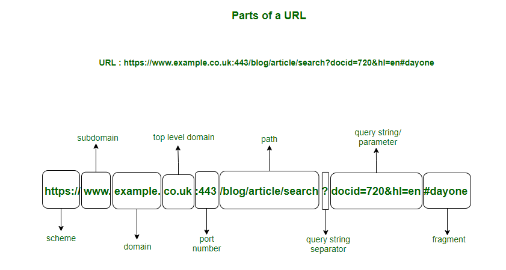

# GoNetHttpAPI

- The purpose of this project is to create a simple GO API using only net/http and limited libraries. (no gorilla/mux)

## Server Setup

- [Server Setup](https://pkg.go.dev/net/http#hdr-Servers)
- [Go Middleware for JWT Authentication](https://hackernoon.com/creating-a-middleware-in-golang-for-jwt-based-authentication-cx3f32z8)
- [Go extract query parameters](https://freshman.tech/snippets/go/extract-url-query-params/)
- Components of a URL
  
  [X] [Extract Path Parameters from url request](https://stackoverflow.com/questions/34314975/go-get-path-parameters-from-http-request)
- the call to WriteHeader(http.StatusOK) is unnecessary when using json.Encoder because it automatically writes the HTTP status code of 200 (OK) for you.
- In the Go net/http package, you cannot directly set the HTTP method type for http.HandleFunc. However, you can achieve this by using http.HandlerFunc instead and checking the request method within your handler.
- [JSON Generator](https://json-generator.com/)

## Adding authentication with JWT

- Return a bearer token to be used for authorising protected routes
- Run `go get github.com/dgrijalva/jwt-go`
